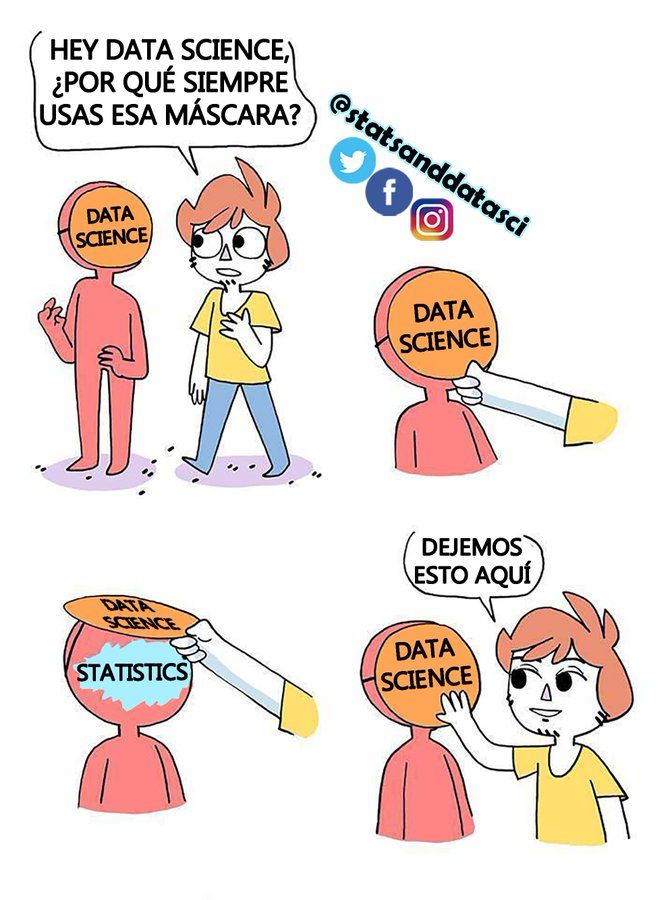
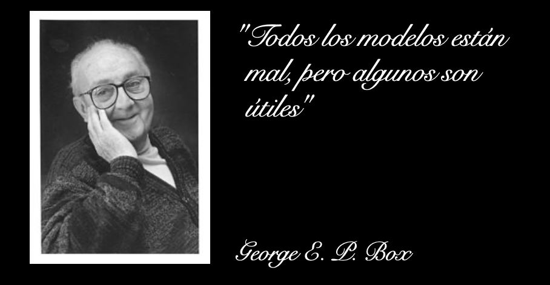

# Análisis de regresión

En aprendizaje automático, se puede encontrar una rama que ellos definen como **análisis de regresión** y que resulta exactamente el mismo tipo de análisis que se puede encontrar en cualquier libro de estadística clásica. Sinceramente no noto ninguna diferencia teórica.  Lo único que es diferente es en el tipo de algoritmo que se utiliza. Es decir, el algoritmo que se utiliza en aprendizaje automático es mas óptimo computacionalmente que el que se utiliza en estadística clásica, (creo).

De cualquier manera, el objetivo de los modelos de regresión es construir una ecuación matemática para una variable de respuesta $y$ continua, con el fin de lograr realizar predicciones sobre esta variable basadas en una o muchas variables predictoras $x$. 

Los modelos de regresión se dividen en técnicas que dependen del tipo de variables que se va a investigar. Por ejemplo, si la variable que se va a predecir es continua y se asume una relación lineal entre el resultado y las variables predictoras, esta técnica se llama regresión lineal. Ver el Capitulo \@ref(lineal). 

La ecuación de regresión lineal se puede escribir como:

$$ y = \beta_0 + \beta_1 x$$

donde: $\beta_0$ es la intersección, $\beta_1$ es el peso o coeficiente de regresión asociado con la variable predictora $x$.

Uno de los métodos mas utilizados en aprendizaje automático para estimar los coeficientes $\beta_0$ y $\beta_1$ se llama método de *mínimos cuadrados ordinarios*, estos están determinador de manera que se minimice el error al predecir el valor del resultado. 

Ahora, si tenemos alguna idea intuitiva para mejorar la predicción de la variable de respuesta que implica añadir una variable predictora, digamos $x_1$ y $x_2$, La ecuación de regresión lineal se puede escribir como:

$$ y = \beta_0 + \beta_1 x_1 +\beta_2 x_2$$

La interacción entre algunos predictores puede ser evidente, es decir, aumentar el valor de una variable predictora $x_1$ puede aumentar la efectividad del predictor $x_2$ con el fin de mejorar la explicación de la la variación en la variable de respuesta. Este tipo de modelo de regresión se llama modelo de regresión múltiple. Ver el Capítulo \@ref(multiple).

Tenga en cuenta también que los modelos de regresión lineal pueden incorporar variables predictoras continuas y categóricas. Ver Capítulo \@ref(categorica).

Después de que construyas el modelo, es necesario saber si el modelo si resulta adecuado para los datos. A eso se le llama, hacer un diagnostico al modelo. Ver el Capítulo \@ref(diagnostico).

Sin embargo, en algunos casos, la relación entre la variable resultado y las variables predictoras no es lineal. En estas situaciones, debe crear una regresión no lineal, como la regresión polinómica y de spline. Esto se ve en el Capítulo \@ref(Nolineal).

## Modelo Lineal {#lineal}

## Modelo Multiple {#multiple}

## Modelo Multiple {#categorica}

## Suposiciones y diagnósticos de regresión {#diagnostico}

## Modelos no lineales {#Nolineal}

